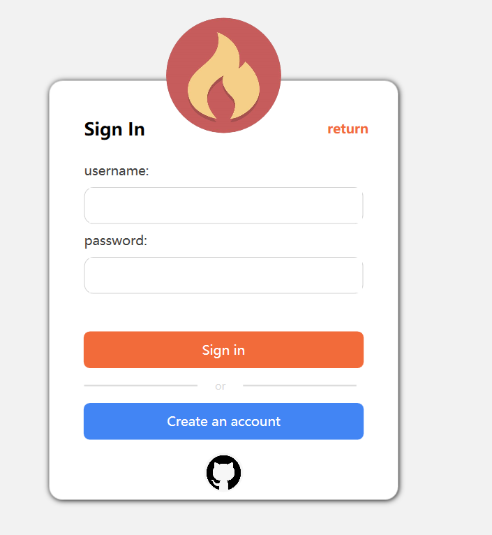
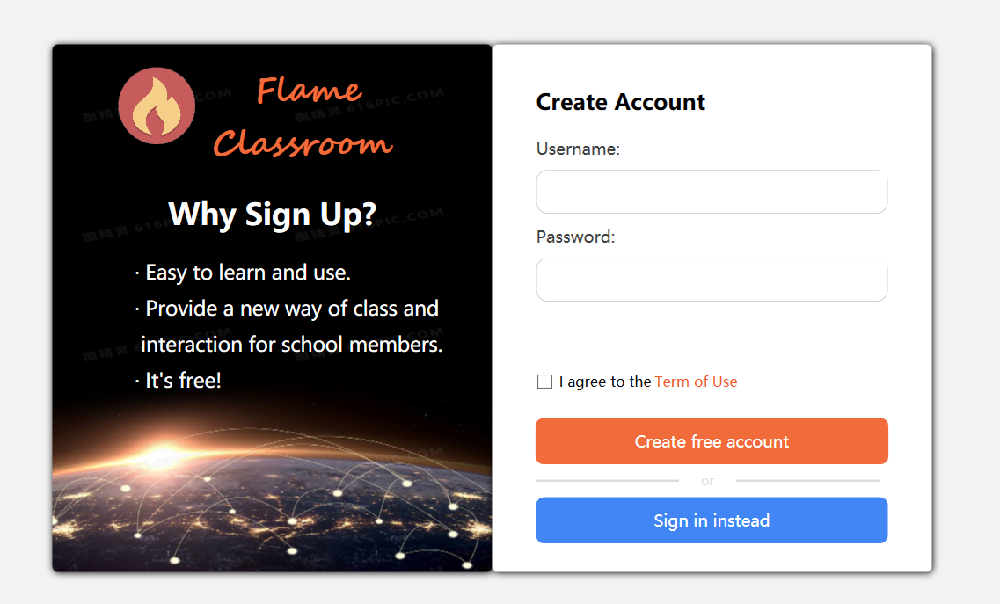
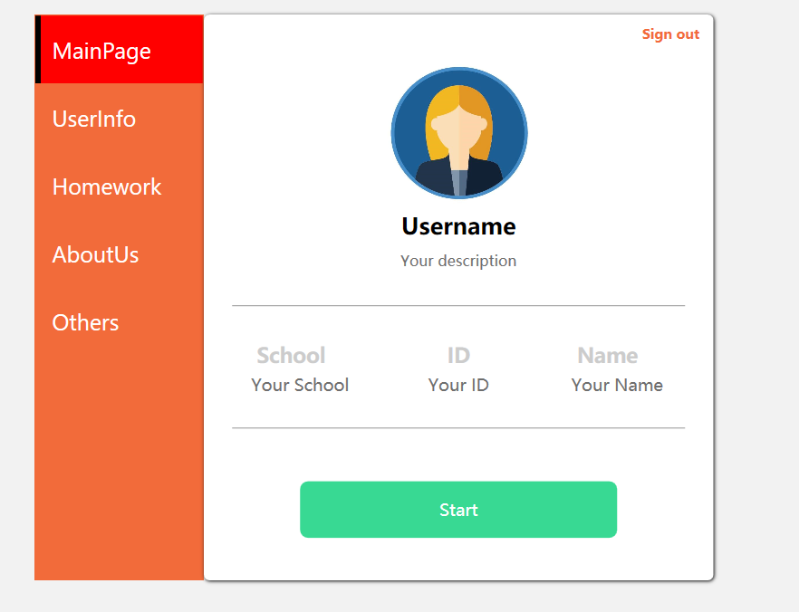
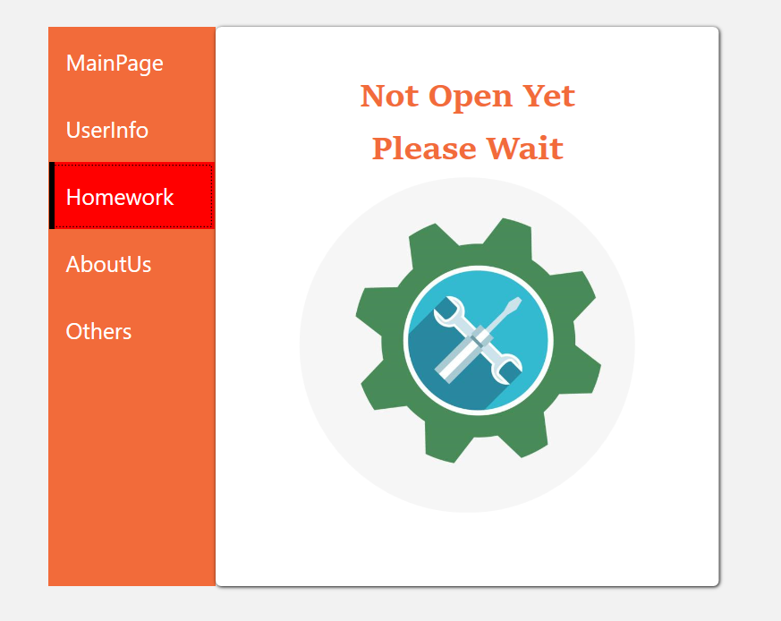
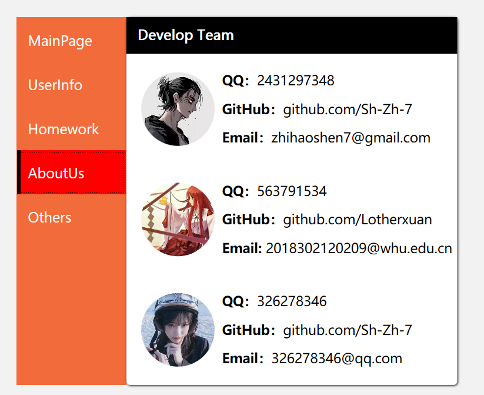
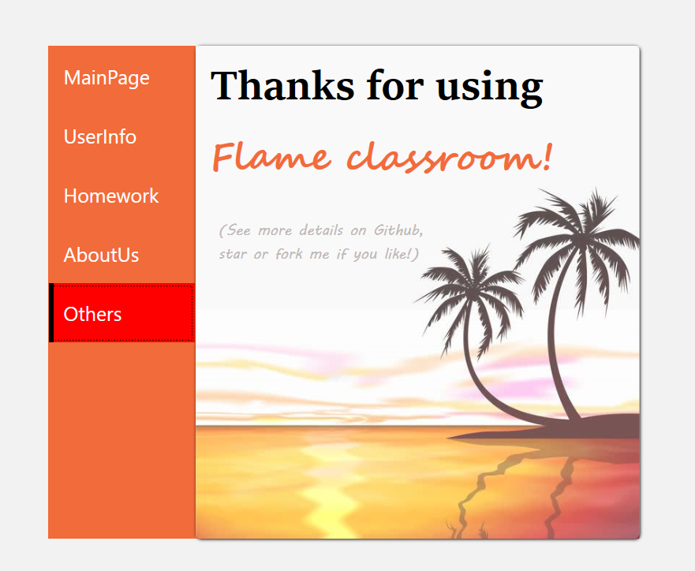
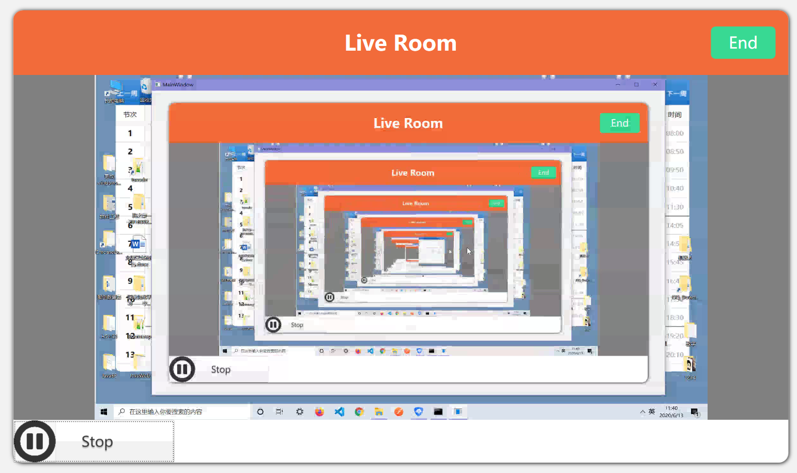
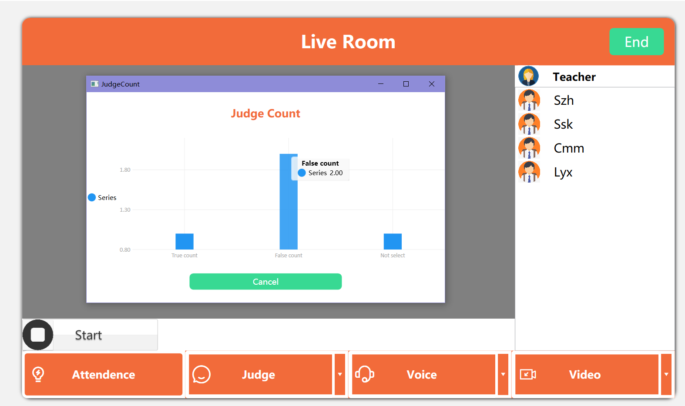

  

<h1 align="center">Flame Classroom</h1>

<B>A lightweight live demo in response to covid-19</B>

    
    
  

## Note

This project is only a **semi-finished** product. It can't even guarantee that you can run it immediately, so we are adding more complex logic and features to this repo.

The biggest disadvantage of this product is **the problem of architecture**. Live broadcast requires high-performance and high bandwidth servers, but we **don't have the money** to implement it. So we regard the teacher end as a server, which is a very dirty implementation, for a lot of information have to be stored in teacher’s computer.

## How to use

1. Clone or download the repo.
2. Open the .sln file in VS 2017 or higher editions. And start this project **in x64 mode CPU**.
3. Choose  your identification, that’s to say, if you’re a student, select the student button and input your teacher’s **IP address**; if you’re a teacher, select the teacher button and input your name and **IP address**(we carefully remove the teacher sign in part).
4. If you select the student button, you have to log in at first. If you haven’t sign up any account before, you are supposed to create a new account. All these procedure are just the same as normal website’s log in.
5. The teacher and student both have the similar home page. **You should edit your profile to make others clear who you are**, which means you should click the UserInfo tag to edit your personal information.
6. Turn to the MainPage and push the start button then you can start watching or preparing your live. In student part, **you just need to wait the teacher to start**, and ready to answer questions or sign when necessary.
7. If you’re a teacher, you should **select your voice and video devices at first**. These devices’ infomation is generated automaticlly. Then you can push the start button so that your student that in  your live room can watch your live. (**Note we haven’t use any optimization algorithm so there will be few seconds  for your student to get what your live content**)
8. In order to increase the interaction of the classroom, we prepare the sign part and problem part. **When you push the sign, you can get a plot that show the number of student responses**. **When you push the problem button and select the problem mode(judegement or selection), you can as well get a plot that can show students’ answers**.

(If you are still confused with how to use this software, we carefully prepare the demo video: [bilibili](https://www.bilibili.com/video/BV1zi4y1x7Bv/))

## Preview

### Sign in:

### Sign up:

### After log in:

## Live Part

**Student Part：**

Push start button to watch teacher’s live. Remember to push confirm  and choose the best answer when teacher release the sign and questions.

**Teacher Part:**

Choose your video and vioce device, and push the start button to start your live. When necessary, you can release the sign and judge or selection questions. You can watch the statistical data from the students ends.

## TODO

- [ ] Deploy services to high performance and high bandwidth servers.
- [ ] Reformat the whole project to enhance readability and scalability.
- [ ] Add other useful features, such as distributing jobs.
- [ ] Enhance login logic to increase robustness of code.

## LICENSE： 

[MIT License](https://github.com/Sh-Zh-7/Flame-Classroom/blob/master/LICENSE/)

Copyright (c) 2020 sh-zh-7

